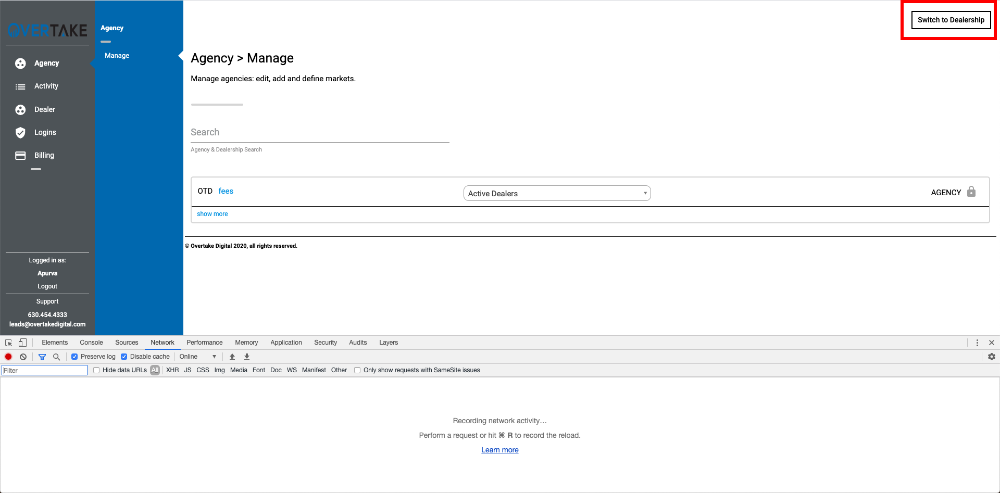
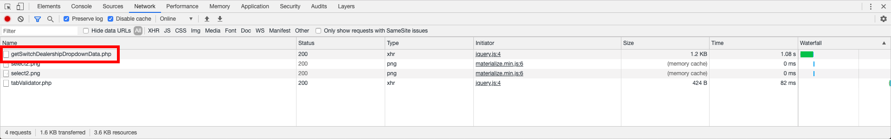
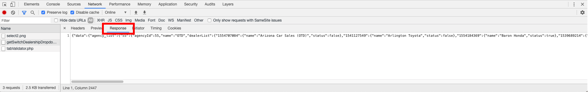

# Tap Script

This is a script does the following:

1. Pulls in data from the [TapClassifieds API](http://postingtool.overtakedigital.com/)
2. Converts it to a CSV,
3. Emails it via [SendGrid](https://sendgrid.com/) to [NinjaCat](https://app.ninjacat.io/)

Any relavent logins for each service should be in the Logins sheet.

## How To Add An Account

To pull data for a new account, open the file named `lib/constants.js`. In this file there is an array named `DEALERS` containing a list of objects like the following:

```
{
  dealerName: "Headquarter Honda",
  dealerID: "1556775683"
}
```

Simply add a new object to this array with the `dealerName` and `dealerID`. The dealer name has to be the same name as the account on NinjaCat. The dealer id is a little more complicated to get...



Log in to [TapClassifieds](http://postingtool.overtakedigital.com/). Open the "Network" tab of your developer tools and click the "Switch To Dealership" button in the top right corner.



Click "getSwitchDealershipDropdownData.php"



With the "Response" tab selected there should be data with a list of dealerships and their associated IDs.
